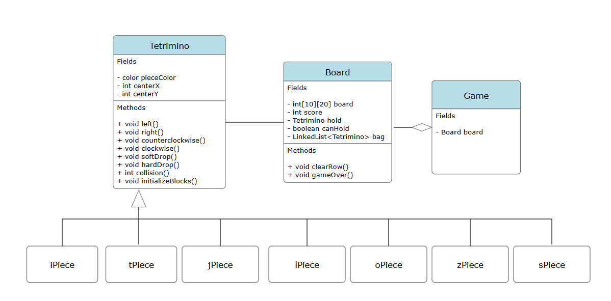

# Technical Details:

## Tetrimino
- Abstract class
### Fields
- color pieceColor
- int centerX
- int centerY
### Methods (abstract)
- void left()
- void right()
- void counterclockwise()
- void clockwise()

## Board
### Fields
### Methods

# Project Design

The Board class will act as the "main" class, of which the Processing project will be made off of. It will deal with most of the functionality of the game, including score tracking, UI, tetrimino randomization, and clearing/bonuses. Each piece will inherit the Tetrimino class, and have small tweaks based on their shape and color. 

# Intended pacing:

- 05/22: Start writing Tetrimino class(Sean) and Board class(Andy)
- 05/23: Continue working on classes
- 05/27: Complete Tetrimino and Board class
- 05/28: Write tPiece, jPiece, lPiece, oPiece, iPiece, zPiece, sPiece classes(half and half)
- 05/29: Upgrade visual appearance(Sean) / work on animation(Andy)
- 05/30: Continue work from previous day
- 06/02: Testing/tweaking issues; buffer day for any setbacks
- 06/03: Add two-player mode(Sean) / NES mode(Andy)
- 06/04: Continue building alternate modes
- 06/05: Implement new modes and fix bugs
- 06/06: Final testing of UI, revisions
