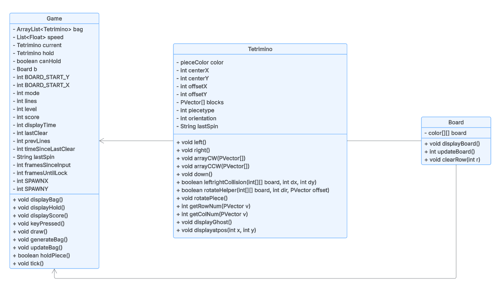

# Technical Details:

## Tetrimino
### Fields
- color pieceColor
  - Color for each piece.
- int centerX
  - x coordinate of center block.
- int centerY
  - y coordinate of center block.
- (new) int offsetX
- (new) int offsetY
- ~~PVector[][] blocks~~
  - ~~Subarray containing different orientations of each tetrimino as PVectors, outer array represents different types~~
- (new) PVector[] blocks
  - Size 4 array, each vector contains relative position to a center block.
- (new) int piecetype
  - Used in ghost block methods
- (new) int orientation
  - 0-3 for the 4 different orientations, stores current orientation to be evaluated for kicks

### Methods
- (new) Tetrimino(int x, int y, int type)
  - Creates specific type of tetrimino with their respective PVector for the four blocks
- void left()
  - Move tetrimino leftwards on screen.
- void right()
  - Move tetrimino towards rightside of screen.
- (new) void arrayCW(PVector[])
  - Rotates every vector in the array by 90 degrees clockwise
- (new) void arrayCCW(PVector[])
  - Rotates every vector in the array by 90 degrees counterclockwise
- ~~void counterclockwise()~~ - moved to rotatePiece
  - ~~Rotate tetrimino 90 degrees counterclockwise every call.~~
- ~~void clockwise()~~
  - ~~Rotate tetrimino 90 degrees clockwise every call.~~
- void ~~softDrop()~~ renamed to down()
  - ~~Regular speed of tetrimino falling.~~
  - Shifts down one tick
- ~~void hardDrop()~~ instead of hardDrop, just call down() repeatedly
  - ~~Immediate drop once called.~~
- (new) ~~int~~~~boolean~~ ~~collision()~~ ~~collision(int dx, int dy, )~~ - decided to break collision checks into rotation collisions and left/right collisions
  - ~~Determines location of tetrimino to be dropped based on other block configurations on the screen~~.
  - ~~Helper method to see if a block collides with the border or another block~~
- (new) boolean leftrightCollision(int[][] board, int dx, int dy)
  - Determines if it is possible to move left, right, or down (no rotations)
- ~~(new) void rotationCollision(int[][] board, PVector[] rot)~~ (newer) boolean -~~rotatePiece~~ ~~rotateHelper(int[][] board, int dir)~~ (new) rotateHelper(int[][] board, int dir, PVector offset)
  - Determines if it is possible to rotate 
    - (new) tries to shift the piece by offset first, and then checks if rotation is possible
  - (new) now rotates the piece if it is possible to rotate (replaces counterclockwise() and clockwise() since we have to rotate in this method anyways)
  - returns true if successful, false if there was something in the way
  - renamed to rotateHelper, and the new rotatePiece method accounts for wall kicks.
- (new) rotatePiece
  - Tries to rotate in place, if that fails, moves right and rotates, if that fails, moves left and rotates, and if that fails, does nothing.
- ~~(new) void initializeBlocks()~~
  - ~~To be implemented differently depending on tetrimino configuration of blocks. Will initialize PVectors for each of the four blocks in the tetrimino.~~
  - Implemented in the constructor without need for a new method
- (new) int getRowNum(PVector v)
  - Given the center position (centerY) and the displacement (v), returns the corresponding rowNum in board
- (new) int getColNum(PVector v)
- (new) displayGhost()
  - Displays where the block would go if it was hard dropped
- (new) displayatpos(int x, int y)
  - Displays tetrimino at given (x, y) coordinate of the screen, used for bag and hold display

## Board
### Fields
- ~int[][] board~
    - ~Each integer denotes the color of the block in that spot. 0 denotes that the square is empty.~
    - ~10 x 20 board~
- (new) color[][] board
    - Stores the color at each square. 
    - 10 x 20 board
- ~~int score~~ EVERYTHING BELOW MOVED TO GAME CLASS
- ~~Tetrimino hold~~
    - ~~This is the piece that will be held.~~
- ~~boolean canHold~~
    - ~~Checks if you have already used hold.~~
- ~~LinkedList<Tetrimino> bag~~
    - ~~bag will be implemented as a queue. The next 3 pieces in the queue will be shown.~~
    - ~~Pieces will be added to the bag in groups of 7 (1 of each piece).~~
### Methods
- ~~void clearRow(int r)~~ EVERYTHING BELOW MOVED TO GAME CLASS
    - ~~Clears row at r and increments score appropriately~~
- ~~void gameOver()~~
    - ~~Ends game if the board tops out~~
- ~~void generateBag()~~
    - ~~Adds 7 random things to bag~~
- ~~void pieceDropped()~~
    - ~~Clears rows if necessary and adds more things to bag if the bag is empty~~
- (new) void displayBoard()
    - ~~Calls displayBoard(), displayScore(), displayHold(), displayBag()~~
    - (newer) just displays board
- (new) int updateBoard()
    - Checks for any completed lines, calls clearRow and also returns number of rows cleared
- (new) void clearRow(int r)
    - Moves all rows down by one

## (New) Game
### Fields
- ArrayList<Tetrimino> bag
    - Will be implemented as a queue, and the first 5 elements will be visible. Pieces will be added to the bag in groups of 7 once the length of bag is less than 7.
- (new) Tetrimino current
    - Tetrimino currently being dropped
- Tetrimino hold
- boolean canHold
- int score
    - Score calculated based on rows cleared and multipliers
- (new) int framesSinceInput
  - Counts down from 30 every frame to track when to lock a piece
- (new) int framesUntilLock
  - Ensures that the piece can't stay at the bottom for too long if inputs are being spammed
- (new) int SPAWNX
  - x coordinate of where the blocks start spawning
- (new) int SPAWNY
### Methods
- void displayBag(), displayHold(), displayScore()
- void keyPressed()
    - Contains the responses to inputs
    - (new) always checks for collisions first
- void draw()
- void generateBag()
    - Creates an ArrayList of shuffled tetriminos and adds to current bag
- (new) void updateBag()
    - Checks to see if there are enough tetriminos in current bag, if not call generateBag() to maintain enough
- (new) boolean holdPiece()
    - returns false if a piece was unsucessfully held
- (new) tick()
    - Moves the current piece down and locks if not possible

# Project Design

(old)

(new)

The ~Board~ (new) Game class will act as the "main" class, of which the Processing project will be made off of. It will deal with most of the functionality of the game, including score tracking, UI, tetrimino randomization, and clearing/bonuses. ~Each piece will inherit the Tetrimino class, and have small tweaks based on their shape and color.~ The tetrimino class contains all variations with their respective shapes, orientations, and colors. This class deals with rotations, kicks, and displaying the tetrimino.

# Intended pacing:

- 05/22: Start writing Tetrimino class(Sean) and Board class(Andy)
- 05/23: Continue working on classes
- 05/27: Complete Tetrimino and Board class
- 05/28: ~Write tPiece, jPiece, lPiece, oPiece, iPiece, zPiece, sPiece classes(half and half)~
         (new) Changing to making 2D array of each variation and orientation of tetriminos
- 05/29: Upgrade visual appearance(Sean) / work on animation(Andy)
- 05/30: Continue work from previous day
- 06/02: Testing/tweaking issues; buffer day for any setbacks
- 06/03: Add two-player mode(Sean) / NES mode(Andy)
- 06/04: Continue building alternate modes
- 06/05: Implement new modes and fix bugs
- 06/06: Final testing of UI, revisions
